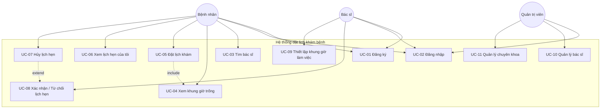

# 1. Yêu cầu của bài toán

## 1.1. Mô tả bài toán

### Bối cảnh

Các phòng khám đa khoa và bệnh viện vừa/nhỏ hiện vẫn phụ thuộc nhiều vào việc đặt lịch khám qua điện thoại hoặc xếp hàng trực tiếp, dẫn đến tình trạng quá tải tổng đài, bệnh nhân chờ đợi lâu, và nhân viên lễ tân khó quản lý lịch làm việc của nhiều bác sĩ cùng lúc. Hệ thống **Đặt lịch khám bệnh trực tuyến** được xây dựng nhằm số hóa quy trình này, cho phép bệnh nhân tự đặt lịch, bác sĩ tự quản lý lịch làm việc, và quản trị viên giám sát toàn bộ hoạt động.

### Mục tiêu

- Cho phép bệnh nhân tìm bác sĩ theo chuyên khoa và đặt lịch khám trực tuyến 24/7.
- Cho phép bác sĩ chủ động thiết lập khung giờ làm việc (time slot) và xác nhận/từ chối lịch hẹn.
- Cho phép quản trị viên quản lý danh sách bác sĩ, chuyên khoa và giám sát toàn bộ lịch hẹn trong hệ thống.
- Giảm tải công việc tổng đài, hạn chế sai sót do đặt lịch trùng giờ.
- Gửi thông báo nhắc lịch hẹn tới bệnh nhân và bác sĩ.

### Phạm vi

**Trong phạm vi:**
- Đăng ký/đăng nhập cho 3 vai trò: Bệnh nhân, Bác sĩ, Quản trị viên.
- Quản lý chuyên khoa, hồ sơ bác sĩ, khung giờ làm việc.
- Đặt lịch, xác nhận, hủy, đổi lịch khám.
- Thông báo (email) khi lịch hẹn được tạo/xác nhận/hủy.

**Ngoài phạm vi (không triển khai trong MVP):**
- Thanh toán trực tuyến, tích hợp bảo hiểm y tế.
- Hồ sơ bệnh án điện tử (EMR) đầy đủ, kê đơn thuốc.
- Ứng dụng di động native (chỉ triển khai web).
- Video call khám từ xa (telemedicine).

### Tác nhân (Actors)

| Actor | Mô tả |
|---|---|
| **Bệnh nhân (Patient)** | Người dùng cuối, tìm bác sĩ, đặt/hủy lịch khám, xem lịch sử khám. |
| **Bác sĩ (Doctor)** | Thiết lập khung giờ làm việc, xác nhận/từ chối lịch hẹn, xem danh sách bệnh nhân trong ngày. |
| **Quản trị viên (Admin)** | Quản lý tài khoản bác sĩ, chuyên khoa; giám sát toàn bộ lịch hẹn hệ thống. |
| **Hệ thống thông báo (Notification Service)** *(actor phụ, hệ thống ngoài)* | Gửi email nhắc lịch/xác nhận cho bệnh nhân và bác sĩ. |

---

## 1.2. Yêu cầu chức năng (Functional Requirements)

### Danh sách chức năng chính

| Mã | Tên chức năng | Tác nhân chính |
|---|---|---|
| UC-01 | Đăng ký tài khoản | Bệnh nhân, Bác sĩ |
| UC-02 | Đăng nhập / Đăng xuất | Tất cả |
| UC-03 | Tìm kiếm bác sĩ theo chuyên khoa | Bệnh nhân |
| UC-04 | Xem khung giờ trống của bác sĩ | Bệnh nhân |
| UC-05 | Đặt lịch khám | Bệnh nhân |
| UC-06 | Xem danh sách lịch hẹn của tôi | Bệnh nhân |
| UC-07 | Hủy lịch hẹn | Bệnh nhân |
| UC-08 | Xác nhận / Từ chối lịch hẹn | Bác sĩ |
| UC-09 | Thiết lập khung giờ làm việc | Bác sĩ |
| UC-10 | Quản lý bác sĩ (thêm/sửa/khóa tài khoản) | Quản trị viên |
| UC-11 | Quản lý chuyên khoa | Quản trị viên |
| UC-12 | Gửi thông báo nhắc lịch | Hệ thống (tự động) |

### Đặc tả chi tiết

#### UC-01: Đăng ký tài khoản
- **Mô tả**: Bệnh nhân tự tạo tài khoản mới bằng email/mật khẩu. Tài khoản Bác sĩ **không** tự đăng ký công khai mà do Quản trị viên khởi tạo (xem UC-10), vì mỗi bác sĩ bắt buộc phải gắn với một chuyên khoa và hồ sơ hành nghề do phòng khám xác thực.
- **Tác nhân liên quan**: Bệnh nhân.
- **Luồng xử lý chính**:
  1. Bệnh nhân nhập email, mật khẩu, họ tên, số điện thoại.
  2. Hệ thống kiểm tra email chưa tồn tại.
  3. Hệ thống mã hóa mật khẩu (bcrypt) và lưu tài khoản với vai trò `PATIENT`.
  4. Hệ thống trả về token đăng nhập.
- **Luồng ngoại lệ**:
  - Email đã tồn tại → trả lỗi 409, yêu cầu nhập email khác.
  - Dữ liệu không hợp lệ (email sai định dạng, mật khẩu < 6 ký tự) → trả lỗi 400.
  - Gửi vai trò khác `PATIENT` qua API đăng ký → trả lỗi 400.

#### UC-02: Đăng nhập / Đăng xuất
- **Mô tả**: Người dùng xác thực để truy cập hệ thống theo vai trò.
- **Tác nhân liên quan**: Bệnh nhân, Bác sĩ, Quản trị viên.
- **Luồng xử lý chính**:
  1. Người dùng nhập email/mật khẩu.
  2. Hệ thống xác thực, phát hành JWT access token kèm vai trò (role).
  3. Người dùng được điều hướng tới giao diện tương ứng vai trò.
- **Luồng ngoại lệ**:
  - Sai email/mật khẩu → trả lỗi 401.
  - Tài khoản bị khóa (do Admin) → trả lỗi 403.

#### UC-03: Tìm kiếm bác sĩ theo chuyên khoa
- **Mô tả**: Bệnh nhân duyệt/tìm bác sĩ theo chuyên khoa, tên.
- **Tác nhân liên quan**: Bệnh nhân.
- **Luồng xử lý chính**:
  1. Bệnh nhân chọn chuyên khoa hoặc nhập từ khóa tìm kiếm.
  2. Hệ thống trả về danh sách bác sĩ phù hợp kèm thông tin cơ bản (tên, chuyên khoa, kinh nghiệm).
- **Luồng ngoại lệ**:
  - Không có bác sĩ phù hợp → hiển thị danh sách rỗng, gợi ý chuyên khoa khác.

#### UC-04: Xem khung giờ trống của bác sĩ
- **Mô tả**: Bệnh nhân xem các khung giờ (time slot) còn trống của một bác sĩ theo ngày.
- **Tác nhân liên quan**: Bệnh nhân.
- **Luồng xử lý chính**:
  1. Bệnh nhân chọn bác sĩ và ngày khám.
  2. Hệ thống truy vấn các slot có trạng thái "còn trống" (isBooked = false) trong ngày đó.
- **Luồng ngoại lệ**:
  - Bác sĩ chưa mở lịch cho ngày được chọn → hiển thị thông báo "chưa có lịch".

#### UC-05: Đặt lịch khám
- **Mô tả**: Bệnh nhân chọn một khung giờ trống và xác nhận đặt lịch.
- **Tác nhân liên quan**: Bệnh nhân.
- **Luồng xử lý chính**:
  1. Bệnh nhân chọn slot còn trống, nhập lý do khám (tùy chọn).
  2. Hệ thống kiểm tra slot vẫn còn trống (tránh race condition).
  3. Hệ thống tạo lịch hẹn với trạng thái `PENDING`, đánh dấu slot `isBooked = true`.
  4. Hệ thống gửi thông báo cho bác sĩ (UC-12).
- **Luồng ngoại lệ**:
  - Slot vừa bị người khác đặt trước (do trùng thời điểm) → trả lỗi 409 "Khung giờ vừa được đặt, vui lòng chọn khung giờ khác".
  - Bệnh nhân đã có lịch hẹn `PENDING`/`CONFIRMED` trùng khung giờ khác → cảnh báo xác nhận.

#### UC-06: Xem danh sách lịch hẹn của tôi
- **Mô tả**: Bệnh nhân xem lịch sử và lịch hẹn sắp tới của bản thân.
- **Tác nhân liên quan**: Bệnh nhân.
- **Luồng xử lý chính**:
  1. Bệnh nhân mở trang "Lịch hẹn của tôi".
  2. Hệ thống trả về danh sách lịch hẹn kèm trạng thái (Chờ xác nhận / Đã xác nhận / Đã hủy / Hoàn thành).
- **Luồng ngoại lệ**: Không có lịch hẹn nào → hiển thị trạng thái rỗng.

#### UC-07: Hủy lịch hẹn
- **Mô tả**: Bệnh nhân hủy lịch hẹn đã đặt.
- **Tác nhân liên quan**: Bệnh nhân.
- **Luồng xử lý chính**:
  1. Bệnh nhân chọn lịch hẹn cần hủy.
  2. Hệ thống kiểm tra thời gian hủy còn hợp lệ (trước giờ khám tối thiểu 2 giờ).
  3. Hệ thống cập nhật trạng thái lịch hẹn thành `CANCELLED`, giải phóng slot (`isBooked = false`).
  4. Hệ thống gửi thông báo hủy cho bác sĩ.
- **Luồng ngoại lệ**:
  - Hủy trễ hơn thời gian cho phép → trả lỗi 400 "Không thể hủy lịch trong vòng 2 giờ trước giờ khám".

#### UC-08: Xác nhận / Từ chối lịch hẹn
- **Mô tả**: Bác sĩ xác nhận hoặc từ chối lịch hẹn đang ở trạng thái `PENDING`.
- **Tác nhân liên quan**: Bác sĩ.
- **Luồng xử lý chính**:
  1. Bác sĩ xem danh sách lịch hẹn chờ xác nhận.
  2. Bác sĩ chọn xác nhận → trạng thái chuyển `CONFIRMED`; hoặc từ chối (kèm lý do) → trạng thái chuyển `CANCELLED`, giải phóng slot.
  3. Hệ thống gửi thông báo kết quả cho bệnh nhân.
- **Luồng ngoại lệ**: Lịch hẹn đã bị bệnh nhân hủy trước khi bác sĩ xử lý → hiển thị trạng thái mới nhất, ngăn thao tác trùng.

#### UC-09: Thiết lập khung giờ làm việc
- **Mô tả**: Bác sĩ tạo các khung giờ khám (time slot) cho những ngày làm việc.
- **Tác nhân liên quan**: Bác sĩ.
- **Luồng xử lý chính**:
  1. Bác sĩ chọn ngày, giờ bắt đầu/kết thúc, thời lượng mỗi slot (ví dụ 30 phút).
  2. Hệ thống sinh tự động danh sách slot tương ứng.
- **Luồng ngoại lệ**: Slot bị trùng với slot đã tồn tại → bỏ qua slot trùng, báo số lượng đã tạo thành công.

#### UC-10: Quản lý bác sĩ
- **Mô tả**: Admin thêm mới, chỉnh sửa thông tin, hoặc khóa/mở khóa tài khoản bác sĩ.
- **Tác nhân liên quan**: Quản trị viên.
- **Luồng xử lý chính**:
  1. Admin nhập thông tin bác sĩ (tên, chuyên khoa, email) để tạo tài khoản.
  2. Hệ thống tạo tài khoản với vai trò `DOCTOR` và gửi mật khẩu tạm qua email.
- **Luồng ngoại lệ**: Email đã tồn tại → trả lỗi 409.

#### UC-11: Quản lý chuyên khoa
- **Mô tả**: Admin thêm/sửa/xóa danh mục chuyên khoa (Nội, Ngoại, Nhi, Da liễu, ...).
- **Tác nhân liên quan**: Quản trị viên.
- **Luồng xử lý chính**: CRUD chuẩn trên bảng `Specialty`.
- **Luồng ngoại lệ**: Xóa chuyên khoa đang có bác sĩ trực thuộc → trả lỗi 400, yêu cầu chuyển bác sĩ sang chuyên khoa khác trước.

#### UC-12: Gửi thông báo nhắc lịch
- **Mô tả**: Hệ thống tự động gửi email khi có sự kiện: đặt lịch mới, xác nhận, hủy, hoặc nhắc lịch trước 24 giờ.
- **Tác nhân liên quan**: Hệ thống thông báo (nội bộ), kích hoạt bởi UC-05/07/08.
- **Luồng xử lý chính**: Business layer phát sự kiện → Notification service gửi email theo template tương ứng.
- **Luồng ngoại lệ**: Gửi email thất bại → ghi log lỗi, không chặn luồng nghiệp vụ chính (không rollback lịch hẹn).

### Sơ đồ UML Use Case

---

## 1.3. Ràng buộc hệ thống (Constraints)

### Ràng buộc công nghệ
- Backend viết bằng **Node.js/Express + TypeScript**, tổ chức theo Layered Architecture.
- Frontend viết bằng **React** (SPA), giao tiếp REST API dạng JSON.
- Cơ sở dữ liệu quan hệ **PostgreSQL**, truy cập qua ORM (Prisma).
- Xác thực bằng **JWT**, không dùng session server-side để đảm bảo khả năng mở rộng (stateless).
- Triển khai bằng **Docker Compose**, phải chạy được trên máy local không cần cài đặt PostgreSQL/Node thủ công.

### Ràng buộc nghiệp vụ
- Mỗi khung giờ (slot) chỉ được gán cho tối đa **một** lịch hẹn còn hiệu lực tại một thời điểm.
- Bệnh nhân chỉ được hủy lịch hẹn trước giờ khám tối thiểu **2 giờ**.
- Bác sĩ chỉ thiết lập khung giờ làm việc cho **tối đa 30 ngày** tới (tránh mở lịch quá xa gây khó quản lý).
- Một tài khoản chỉ có **duy nhất một vai trò** (Patient / Doctor / Admin) tại một thời điểm.
- Lịch hẹn ở trạng thái `PENDING` quá **24 giờ** mà bác sĩ chưa xác nhận sẽ tự động chuyển sang nhắc nhở (không tự hủy trong phạm vi MVP).

---

## 1.4. Thuộc tính chất lượng (Quality Attributes)

### QA-01: Performance (Hiệu năng)
- **Source**: Bệnh nhân (người dùng qua trình duyệt web).
- **Stimulus**: Gửi yêu cầu tìm kiếm bác sĩ theo chuyên khoa vào giờ cao điểm (nhiều người dùng truy cập đồng thời).
- **Environment**: Hệ thống đang vận hành bình thường, tải trung bình 200 request/phút.
- **Artifact**: API `GET /api/doctors`.
- **Response**: Hệ thống trả về danh sách bác sĩ kèm trạng thái slot.
- **Response Measure**: Thời gian phản hồi ở mức p95 ≤ 500ms.

### QA-02: Availability (Tính sẵn sàng)
- **Source**: Một container backend gặp sự cố (crash) do lỗi runtime.
- **Stimulus**: Tiến trình backend bị crash bất ngờ.
- **Environment**: Hệ thống đang hoạt động ở môi trường production (Docker).
- **Artifact**: Service backend (container `api`).
- **Response**: Cơ chế restart policy của Docker tự khởi động lại container; các request trong lúc gián đoạn được trả lỗi 503 thay vì treo.
- **Response Measure**: Hệ thống khôi phục hoạt động trong ≤ 10 giây, uptime ≥ 99% trong tháng.

### QA-03: Security (Bảo mật)
- **Source**: Người dùng không xác thực (kẻ tấn công) cố gắng truy cập API quản trị.
- **Stimulus**: Gửi request tới `PATCH /api/admin/doctors/:id` không kèm token hợp lệ, hoặc token của vai trò Patient.
- **Environment**: Runtime bình thường, API Gateway/middleware xác thực đang hoạt động.
- **Artifact**: Middleware `authMiddleware` + `roleGuard` ở tầng Presentation.
- **Response**: Hệ thống từ chối truy cập, trả về 401 (chưa xác thực) hoặc 403 (không đủ quyền), không thực hiện thao tác.
- **Response Measure**: 100% request trái phép bị chặn trước khi chạm tầng Business; ghi log đầy đủ sự kiện từ chối.

### QA-04: Modifiability (Khả năng sửa đổi)
- **Source**: Nhà phát triển.
- **Stimulus**: Yêu cầu bổ sung kênh thông báo mới (ví dụ SMS) bên cạnh email hiện có.
- **Environment**: Thời điểm phát triển (development time).
- **Artifact**: Module `NotificationService` ở tầng Business.
- **Response**: Chỉ cần thêm một `NotificationProvider` mới implement interface hiện có, không sửa logic đặt lịch/xác nhận.
- **Response Measure**: Thay đổi giới hạn trong 1 module, không quá 1 ngày công, không phá vỡ test hiện có (regression = 0).

### QA-05: Reliability (Độ tin cậy dữ liệu)
- **Source**: Hai bệnh nhân đặt cùng một khung giờ gần như đồng thời.
- **Stimulus**: Hai request `POST /api/appointments` cho cùng `slotId` đến trong khoảng < 100ms.
- **Environment**: Tải cao, cơ sở dữ liệu PostgreSQL với transaction isolation.
- **Artifact**: `AppointmentService` + ràng buộc unique/transaction ở tầng Data Access.
- **Response**: Chỉ một request thành công (slot được khóa bằng transaction + unique constraint); request còn lại nhận lỗi 409.
- **Response Measure**: 0% trường hợp double-booking trong kiểm thử tải đồng thời (100 request/giây lên cùng slot).

### QA-06: Usability (Tính khả dụng/dễ dùng)
- **Source**: Bệnh nhân lần đầu sử dụng hệ thống, không có kỹ năng công nghệ cao.
- **Stimulus**: Người dùng cần đặt lịch khám trong lần truy cập đầu tiên mà không có hướng dẫn trước.
- **Environment**: Giao diện web trên desktop/mobile, kết nối mạng ổn định.
- **Artifact**: Luồng UI đặt lịch (chọn chuyên khoa → bác sĩ → slot → xác nhận).
- **Response**: Người dùng hoàn tất đặt lịch mà không cần hỗ trợ.
- **Response Measure**: ≥ 90% người dùng thử nghiệm hoàn tất đặt lịch trong ≤ 3 phút, tối đa 4 bước thao tác.
