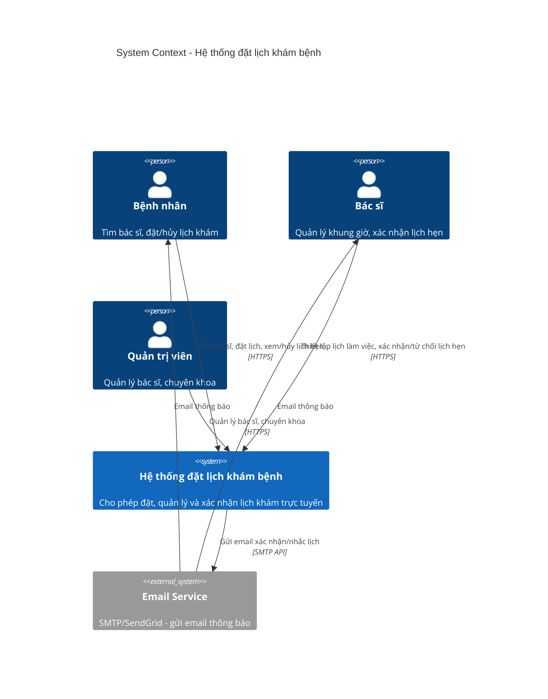
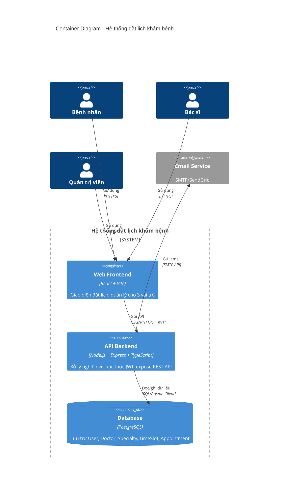
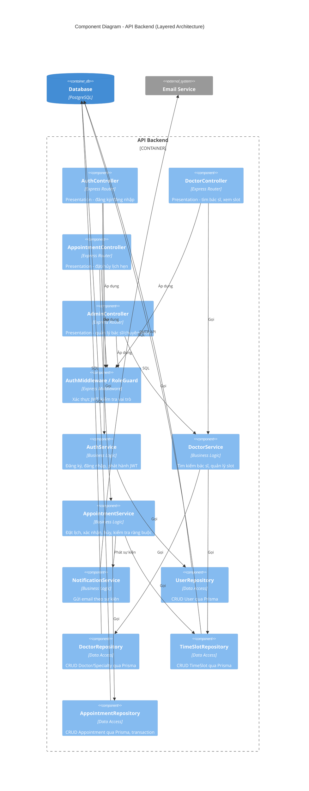
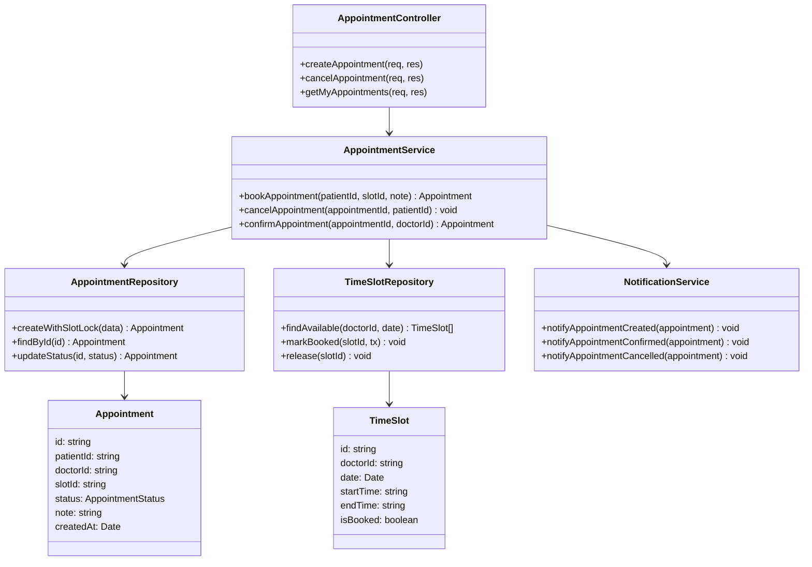

# 2. Thiết kế kiến trúc (C4 Model)

## Lựa chọn kiến trúc

Hệ thống áp dụng **Layered Architecture** (kiến trúc phân tầng) cho container API Backend, gồm 3 tầng:

- **Presentation Layer**: nhận HTTP request, xác thực đầu vào, điều hướng tới Business Layer, định dạng response.
- **Business Layer**: chứa toàn bộ logic nghiệp vụ (đặt lịch, xác nhận, kiểm tra ràng buộc trùng slot, gửi thông báo).
- **Data Access Layer**: truy vấn/ghi dữ liệu qua ORM (Prisma), tách biệt hoàn toàn khỏi logic nghiệp vụ.

**Lý do lựa chọn**: bài toán có nghiệp vụ vừa phải, một nhóm nhỏ phát triển trong thời gian ngắn (MVP). Layered Architecture đơn giản, dễ hiện thực đúng tiến độ, dễ kiểm thử từng tầng độc lập, và ánh xạ trực tiếp 1-1 với cấu trúc thư mục mã nguồn — giảm rủi ro "kiến trúc thiết kế không khớp mã nguồn" (mục bị trừ điểm theo rubric).

---

## Level 1: System Context Diagram

---

## Level 2: Container Diagram

---

## Level 3: Component Diagram (bên trong API Backend)

---

## Level 4: Code Diagram (khuyến khích) — luồng đặt lịch khám

---

## Trách nhiệm từng thành phần

| Thành phần | Trách nhiệm | Tầng |
|---|---|---|
| Web Frontend | Hiển thị UI, gọi API, quản lý state phía client | - |
| Controller (Auth/Doctor/Appointment/Admin) | Nhận request, validate input cơ bản, gọi Service, trả response | Presentation |
| AuthMiddleware / RoleGuard | Xác thực JWT, kiểm tra vai trò truy cập | Presentation |
| Service (Auth/Doctor/Appointment/Notification) | Toàn bộ logic nghiệp vụ, ràng buộc, điều phối transaction | Business |
| Repository (User/Doctor/TimeSlot/Appointment) | Truy vấn/ghi dữ liệu, không chứa logic nghiệp vụ | Data Access |
| PostgreSQL | Lưu trữ dữ liệu bền vững, đảm bảo transaction/unique constraint | - |
| Email Service | Gửi email thông báo (dịch vụ ngoài) | - |

## Quyết định kiến trúc quan trọng và liên hệ với thuộc tính chất lượng

1. **Tách Data Access khỏi Business bằng Repository pattern** → hỗ trợ trực tiếp **QA-04 Modifiability**: có thể đổi ORM/database mà không sửa logic nghiệp vụ.
2. **Kiểm tra và khóa slot bằng transaction ở tầng Repository** (`createWithSlotLock`) → đảm bảo **QA-05 Reliability**, tránh double-booking khi nhiều bệnh nhân đặt đồng thời.
3. **AuthMiddleware/RoleGuard đặt ở Presentation, chặn trước khi vào Business** → đảm bảo **QA-03 Security**, mọi request trái phép bị từ chối sớm, giảm tải xử lý không cần thiết (gián tiếp hỗ trợ Performance).
4. **NotificationService tách biệt, không nằm trong luồng transaction chính của AppointmentService** → lỗi gửi email không làm rollback lịch hẹn, hỗ trợ **QA-02 Availability** của luồng nghiệp vụ chính.
5. **Stateless API (JWT, không session server)** → cho phép chạy nhiều instance backend phía sau load balancer trong tương lai, hỗ trợ **QA-01 Performance/Scalability** khi tải tăng.

## Ưu điểm

- Cấu trúc rõ ràng, dễ onboard thành viên mới trong nhóm.
- Dễ kiểm thử: có thể unit test Service độc lập bằng cách mock Repository.
- Ánh xạ trực tiếp sang cấu trúc thư mục, giảm rủi ro lệch giữa thiết kế và mã nguồn.
- Phù hợp quy mô MVP, không tốn overhead hạ tầng như Microservices.

## Nhược điểm

- Khó mở rộng độc lập từng phần (không thể scale riêng module Appointment mà không scale cả API).
- Business Layer có xu hướng phình to khi hệ thống lớn dần (nguy cơ "fat service").
- Tầng Presentation và Business vẫn có thể vô tình rò rỉ phụ thuộc lẫn nhau nếu không kỷ luật code review.
- Một lỗi ở tầng Data Access (vd. deadlock) có thể ảnh hưởng toàn bộ API vì chạy chung 1 tiến trình/container.
