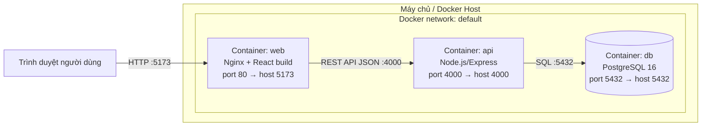

# 4. Triển khai hệ thống

## Kiến trúc triển khai thực tế

Hệ thống được đóng gói bằng **Docker Compose** thành 3 container chạy trên cùng một Docker network nội bộ, mô phỏng môi trường triển khai thực tế (có thể thay `docker-compose` bằng Kubernetes/Cloud sau này mà không đổi kiến trúc ứng dụng).



- **web**: build React bằng Vite, phục vụ static files qua Nginx.
- **api**: build TypeScript → JavaScript, chạy Express bằng Node.js, tự áp dụng schema Prisma và seed dữ liệu mẫu khi khởi động.
- **db**: PostgreSQL, dữ liệu lưu bền vững qua Docker volume `db_data`.

## Môi trường triển khai

| Thành phần | Công nghệ | Ghi chú |
|---|---|---|
| Container hóa | Docker, Docker Compose | Chạy được trên mọi máy có Docker, không cần cài Node/Postgres thủ công |
| Backend runtime | Node.js 20 (alpine) | Multi-stage build: build TypeScript ở stage riêng, runtime nhẹ |
| Frontend runtime | Nginx 1.27 (alpine) | Phục vụ static SPA, fallback `try_files` cho React Router |
| Database | PostgreSQL 16 (alpine) | Volume `db_data` đảm bảo dữ liệu không mất khi container restart |

## Quy trình triển khai

1. `docker compose build` — build image cho `api` và `web` (2 stage: build + runtime).
2. `docker compose up -d db` — khởi động PostgreSQL trước, có `healthcheck` (`pg_isready`) đảm bảo DB sẵn sàng.
3. `docker compose up -d api` — container `api` chờ `db` healthy (`depends_on: condition: service_healthy`), sau đó entrypoint tự chạy `prisma db push` để đồng bộ schema và seed dữ liệu mẫu (`RUN_SEED=true`).
4. `docker compose up -d web` — container `web` build React với `VITE_API_URL` trỏ về API, phục vụ qua Nginx.
5. Toàn bộ có thể thực hiện bằng một lệnh duy nhất: `docker compose up -d --build`.

## Hướng dẫn cài đặt và vận hành

### Chạy bằng Docker (khuyến khích)

```bash
docker compose up -d --build
```

- Frontend: http://localhost:5173
- Backend API: http://localhost:4000/api
- Health check: http://localhost:4000/health

Tài khoản demo (được seed tự động):

| Vai trò | Email | Mật khẩu |
|---|---|---|
| Quản trị viên | admin@clinic.vn | Admin@123 |
| Bác sĩ | bs.an@clinic.vn | Doctor@123 |
| Bệnh nhân | benhnhan@example.com | Patient@123 |

Dừng hệ thống: `docker compose down` (thêm `-v` nếu muốn xóa luôn dữ liệu volume).

### Chạy thủ công (development, không dùng Docker)

**Backend:**
```bash
cd backend
cp .env.example .env   # chỉnh DATABASE_URL trỏ tới PostgreSQL local
npm install
npx prisma db push
npm run build && npm run seed   # seed dùng bản JS đã build để tránh lỗi ts-node/ESM trên Node 20+
npm run dev                      # http://localhost:4000
```

**Frontend:**
```bash
cd frontend
cp .env.example .env
npm install
npm run dev              # http://localhost:5173
```

## Minh chứng hệ thống hoạt động

*Nhóm bổ sung ảnh chụp màn hình hoặc video demo vào thư mục `docs/screenshots/` sau khi chạy thử nghiệm luồng: đăng ký bệnh nhân → tìm bác sĩ → đặt lịch → bác sĩ xác nhận → bệnh nhân xem trạng thái lịch hẹn.*
